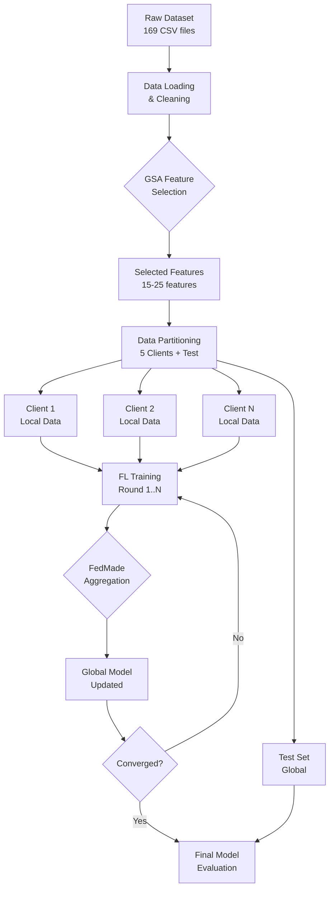
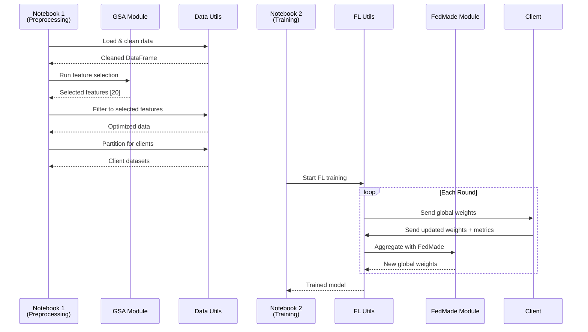

# Design Document: GSA Feature Selection & FedMade Aggregation

## Overview

This document details the architectural design for integrating two optimization techniques into the Federated Learning IoT attack detection system:

1. **GSA (Gravitational Search Algorithm)** - Metaheuristic optimization for feature selection
2. **FedMade** - Advanced federated aggregation strategy

## Design Goals

### Primary Goals
- **Improve Model Accuracy**: Reach ≥95% accuracy through better features and aggregation
- **Reduce Dimensionality**: Eliminate noisy/redundant features (46 → ~20 features)
- **Enhance FL Convergence**: Smarter aggregation for heterogeneous clients
- **Maintain Compatibility**: Work seamlessly with existing TabTransformer + PyTorch infrastructure

### Non-Goals
- ❌ Real-time online feature selection (GSA runs once during preprocessing)
- ❌ Privacy-preserving aggregation (differential privacy out of scope)
- ❌ Multi-server federated architecture (single server assumed)

## Architecture Overview

### System Flow



### Component Interaction



## Component 1: GSA Feature Selection

### Algorithm Design

The Gravitational Search Algorithm (GSA) is a population-based metaheuristic inspired by Newton's law of gravitation:

**Core Concept**: Feature subsets are particles with mass. Better subsets (higher fitness) have more mass and attract other particles.

### GSA Pseudocode

```python
def gsa_feature_selection(X, y, num_features, max_iterations):
    # 1. Initialize population
    population = initialize_random_binary_population(size=30, dim=46)
    velocities = zeros(30, 46)
    
    # 2. Main loop
    for iteration in range(max_iterations):
        # 2.1 Evaluate fitness
        fitness = [evaluate_feature_subset(X, y, particle) for particle in population]
        
        # 2.2 Calculate masses
        masses = calculate_masses(fitness)  # Better fitness → higher mass
        
        # 2.3 Calculate forces
        G = G_initial * exp(-alpha * iteration / max_iterations)  # Decay constant
        forces = calculate_gravitational_forces(population, masses, G)
        
        # 2.4 Update velocities and positions
        for i in range(population_size):
            acceleration = forces[i] / masses[i]
            velocities[i] = random() * velocities[i] + acceleration
            population[i] = sigmoid(velocities[i])  # Convert to binary [0,1]
            population[i] = (population[i] > 0.5).astype(int)  # Threshold
    
    # 3. Return best solution
    best_idx = argmax(fitness)
    return population[best_idx]
```

### Fitness Function

The fitness of a feature subset is the **validation accuracy** of a lightweight classifier:

```python
def evaluate_feature_subset(X, y, feature_mask):
    # Select features
    X_selected = X[:, feature_mask == 1]
    
    # Handle edge cases
    if X_selected.shape[1] == 0:
        return 0.0  # Empty feature set
    
    # Train-val split
    X_train, X_val, y_train, y_val = train_test_split(X_selected, y, test_size=0.2)
    
    # Train fast classifier (Random Forest or Logistic Regression)
    clf = RandomForestClassifier(n_estimators=50, max_depth=10)
    clf.fit(X_train, y_train)
    
    # Return validation accuracy
    return accuracy_score(y_val, clf.predict(X_val))
```

**Design Decisions**:
- **Classifier Choice**: Random Forest (fast, handles multi-class well)
- **Evaluation Speed**: Use 10-20% data sample for GSA fitness (full data too slow)
- **Validation Split**: 80-20 split for robust fitness estimation

### GSA Parameters

| Parameter | Value | Rationale |
|-----------|-------|-----------|
| `population_size` | 30 | Balance exploration vs computation |
| `max_iterations` | 50 | Sufficient for convergence on 46 features |
| `num_features_to_select` | 20 | ~40% reduction, balances info vs noise |
| `G_initial` | 100.0 | Standard GSA gravitational constant |
| `alpha` | 20.0 | Controls G decay rate |

### Binary Encoding

Features are encoded as binary vectors:
- **1** = feature selected
- **0** = feature not selected

Example:
```python
feature_mask = [1, 0, 1, 1, 0, ..., 1]  # 46 binary values
selected_features = X_columns[feature_mask == 1]
# ['flow_duration', 'fwd_pkts_tot', ..., 'bwd_iat_std']
```

### Output Format

GSA produces:
1. **`selected_features.json`**: List of selected feature names
2. **`gsa_convergence.png`**: Plot showing fitness over iterations
3. **`feature_importance.json`**: How often each feature was in best solutions

Example JSON:
```json
{
  "selected_features": [
    "flow_duration", "fwd_pkts_tot", "bwd_pkts_tot",
    "flow_iat_mean", "fwd_pkt_len_mean", ...
  ],
  "num_selected": 20,
  "num_original": 46,
  "best_fitness": 0.9523,
  "iterations_to_converge": 42
}
```

## Component 2: FedMade Aggregation

### Motivation

Standard **FedAvg** (Federated Averaging) treats all clients equally:

```python
# FedAvg
global_weights = sum(client_weights * num_samples) / total_samples
```

**Problems with FedAvg**:
1. **Ignores data quality**: Client with noisy data gets same weight as clean data
2. **Ignores model performance**: Bad local models drag down global model
3. **No robustness**: Outlier clients can hurt aggregation

### FedMade Design

**FedMade** (Federated Model Aggregation with Dynamic Evaluation) addresses these issues:

```python
# FedMade
contribution_scores = compute_scores(client_metrics)  # Based on performance
global_weights = weighted_average(client_weights, contribution_scores)
```

### FedMade Algorithm

```python
def fedmade_aggregate(client_state_dicts, client_metrics, global_model):
    """
    Args:
        client_state_dicts: List of OrderedDict (model weights from clients)
        client_metrics: List of dict with {'accuracy', 'loss', 'num_samples'}
        global_model: Current global model (for reference)
    
    Returns:
        aggregated_state_dict: New global model weights
    """
    # 1. Compute contribution scores
    scores = compute_client_contribution_scores(client_metrics)
    
    # 2. Filter low-quality clients (optional)
    threshold = config.contribution_threshold  # e.g., 0.3
    valid_clients = [i for i, s in enumerate(scores) if s >= threshold]
    
    if len(valid_clients) == 0:
        # Fallback to FedAvg if all clients filtered
        return federated_averaging_pytorch(client_state_dicts, 
                                           [m['num_samples'] for m in client_metrics])
    
    # 3. Layer-wise weighted aggregation
    aggregated_dict = OrderedDict()
    for layer_name in client_state_dicts[0].keys():
        layer_weights = [client_state_dicts[i][layer_name] for i in valid_clients]
        layer_scores = [scores[i] for i in valid_clients]
        
        # Weighted average
        aggregated_dict[layer_name] = sum(w * s for w, s in zip(layer_weights, layer_scores))
        aggregated_dict[layer_name] /= sum(layer_scores)
    
    return aggregated_dict
```

### Contribution Score Calculation

Contribution scores are based on client validation performance:

```python
def compute_client_contribution_scores(client_metrics):
    """
    Compute normalized contribution scores from client metrics.
    
    Scoring formula:
        score_i = (accuracy_i * weight_acc) + ((1 - normalized_loss_i) * weight_loss)
    
    Then normalize to sum to 1.
    """
    accuracies = np.array([m['accuracy'] for m in client_metrics])
    losses = np.array([m['loss'] for m in client_metrics])
    
    # Normalize losses (lower is better, so invert)
    max_loss = losses.max()
    normalized_losses = 1 - (losses / max_loss) if max_loss > 0 else np.ones_like(losses)
    
    # Weighted combination
    weight_acc = 0.7
    weight_loss = 0.3
    scores = (accuracies * weight_acc) + (normalized_losses * weight_loss)
    
    # Normalize to sum to 1
    scores = scores / scores.sum()
    
    return scores.tolist()
```

**Design Rationale**:
- **Accuracy-focused**: 70% weight on accuracy (primary metric)
- **Loss regularization**: 30% weight on loss (avoid overfitting)
- **Normalization**: Ensures scores sum to 1 (proper weighted average)

### Layer-wise Matching

FedMade aggregates each layer independently:

**Benefits**:
1. **Handles heterogeneity**: Different layers may benefit from different client contributions
2. **Robustness**: One bad layer doesn't invalidate entire client model
3. **Flexibility**: Can extend to more sophisticated matching strategies

**Implementation**:
```python
for layer_name in ['embedding.weight', 'transformer.0.attention.q.weight', ...]:
    # Aggregate this layer across clients
    aggregated_dict[layer_name] = weighted_average(
        [client_dict[layer_name] for client_dict in valid_clients],
        contribution_scores
    )
```

### Client Filtering

Low-quality clients can be excluded:

```python
contribution_threshold = 0.3  # From config

# Filter clients with score < threshold
valid_clients = [i for i, score in enumerate(scores) if score >= threshold]
```

**Tradeoffs**:
- **Pros**: Improves aggregation quality, faster convergence
- **Cons**: Wastes some client computation
- **Recommendation**: Use moderate threshold (0.2-0.3) to filter only very poor clients

### FedMade vs FedAvg Comparison

| Aspect | FedAvg | FedMade |
|--------|--------|---------|
| **Client Weighting** | By sample count only | By performance metrics |
| **Outlier Robustness** | Low (all included) | High (can filter) |
| **Convergence Speed** | Baseline | Faster (empirically) |
| **Computational Cost** | O(n) | O(n·m) where m=layers |
| **Implementation Complexity** | Simple | Moderate |

## Integration Architecture

### Modified Preprocessing Pipeline

**File**: `Notebooks/1_Data_Preprocessing.ipynb`

```python
# === NEW SECTION: GSA Feature Selection ===

from utils.gsa_algorithm import GravitationalSearchAlgorithm

# Load configuration
gsa_config = config['gsa']

# Prepare data for GSA (use sample for speed)
X_sample, y_sample = data[:int(len(data) * 0.2)], labels[:int(len(labels) * 0.2)]

# Run GSA
gsa = GravitationalSearchAlgorithm(
    num_features=46,
    target_num_features=gsa_config['num_features_to_select'],
    population_size=gsa_config['population_size'],
    max_iterations=gsa_config['max_iterations']
)

best_features_mask = gsa.run(X_sample, y_sample)
selected_features = [X_columns[i] for i in range(46) if best_features_mask[i] == 1]

# Save results
with open('../Output/gsa_results/selected_features.json', 'w') as f:
    json.dump({'selected_features': selected_features}, f)

# Filter dataset
X_filtered = data[selected_features]

# Continue with rest of pipeline (normalize, partition, etc.)
```

### Modified FL Training Loop

**File**: `Notebooks/2_Federated_Training.ipynb`

```python
from utils.fedmade_aggregation import fedmade_aggregate

aggregation_method = config['aggregation']['method']  # 'fedavg' or 'fedmade'

# In training loop
for round_num in range(num_rounds):
    client_state_dicts = []
    client_metrics = []
    
    # Client training
    for client_id in range(num_clients):
        updated_weights, metrics = train_client_pytorch(...)
        client_state_dicts.append(updated_weights)
        client_metrics.append(metrics)
    
    # Aggregation
    if aggregation_method == 'fedmade':
        aggregated_dict = fedmade_aggregate(
            client_state_dicts, 
            client_metrics,
            global_model
        )
    else:  # fedavg
        aggregated_dict = federated_averaging_pytorch(
            client_state_dicts,
            [m['num_samples'] for m in client_metrics]
        )
    
    # Update global model
    global_model.load_state_dict(aggregated_dict)
```

## Configuration Schema

```yaml
# GSA Feature Selection
gsa:
  enabled: true                     # Enable/disable GSA
  num_features_to_select: 20        # Target number of features
  max_iterations: 50                # GSA iterations
  population_size: 30               # Number of particles
  gravitational_constant: 100.0     # Initial G value
  alpha: 20.0                       # G decay rate
  use_sample: true                  # Use data sample for speed
  sample_fraction: 0.2              # Fraction of data to sample
  classifier: random_forest         # Fitness evaluation classifier
  cv_folds: 5                       # Cross-validation folds (optional)
  random_seed: 42                   # Reproducibility

# Aggregation Strategy
aggregation:
  method: fedmade                   # 'fedavg' or 'fedmade'
  
  fedmade:
    use_client_metrics: true        # Use validation metrics
    layer_matching: true            # Layer-wise aggregation
    contribution_threshold: 0.3     # Min score to include client
    accuracy_weight: 0.7            # Weight for accuracy in scoring
    loss_weight: 0.3                # Weight for loss in scoring
    normalize_scores: true          # Normalize scores to sum to 1
```

## Data Flow

### Phase 1: Preprocessing (with GSA)

```
Raw Data (169 CSVs, ~12GB)
    ↓
[Load & Merge] → Combined DataFrame (46 features, ~1M samples)
    ↓
[Clean] → Remove duplicates, handle missing values
    ↓
[GSA Feature Selection] → 20 selected features
    ↓
[Filter] → Filtered DataFrame (20 features, ~1M samples)
    ↓
[Encode Labels] → Numeric labels (0-33)
    ↓
[Normalize] → MinMaxScaler on 20 features
    ↓
[Partition] → 5 client datasets + 1 test set
    ↓
[Save] → client_0.npz, ..., client_4.npz, test.npz
```

### Phase 2: FL Training (with FedMade)

```
Round 1:
    Server: Initialize global model (20 input features)
        ↓
    Clients: Load global weights
        ↓
    Clients: Train locally (5 epochs each)
        ↓
    Clients: Compute validation metrics
        ↓
    Server: Collect {weights, metrics} from 5 clients
        ↓
    Server: FedMade aggregation
        - Compute scores: [0.25, 0.30, 0.15, 0.20, 0.10]
        - Filter: Remove client 2 (score < 0.3)
        - Aggregate: Weighted average with scores
        ↓
    Server: Update global model
        ↓
Round 2: (repeat)
    ...
Round 30: Final global model
```

## Performance Considerations

### GSA Computational Cost

**Time Complexity**: O(population_size × max_iterations × num_features × fitness_cost)

Where `fitness_cost` = training a Random Forest on sampled data

**Optimization Strategies**:
1. **Data Sampling**: Use 10-20% of data for GSA fitness (acceptable approximation)
2. **Fast Classifier**: Random Forest with limited depth (fast, good enough)
3. **Parallel Fitness**: Evaluate population in parallel (if resources available)
4. **Early Stopping**: Stop if no improvement for N iterations

**Expected Time**:
- Small dataset (11 files): ~5-10 minutes
- Full dataset (169 files, 20% sample): ~30-45 minutes

### FedMade Computational Cost

**Time Complexity**: O(num_clients × num_layers × layer_size)

**Overhead vs FedAvg**: ~10-20% slower (negligible compared to training time)

**Memory**: Same as FedAvg (stores one global model state_dict)

## Error Handling

### GSA Failures

**Scenario**: GSA doesn't converge or selects too few features

**Mitigation**:
```python
if num_selected < min_features:
    logger.warning(f"GSA selected only {num_selected} features, using top {min_features}")
    # Fallback: Use top N features by variance or correlation
    selected_features = select_top_n_features(X, y, min_features)
```

### FedMade Failures

**Scenario**: All clients have low contribution scores

**Mitigation**:
```python
if len(valid_clients) == 0:
    logger.warning("No clients passed threshold, falling back to FedAvg")
    return federated_averaging_pytorch(client_state_dicts, client_weights)
```

**Scenario**: Client metrics missing or invalid

**Mitigation**:
```python
try:
    scores = compute_client_contribution_scores(client_metrics)
except (KeyError, ValueError) as e:
    logger.error(f"Invalid metrics: {e}, using equal weights")
    scores = [1/num_clients] * num_clients
```

## Testing Strategy

### Unit Tests

**GSA Module** (`test_gsa_algorithm.py`):
```python
def test_gsa_initialization()
def test_fitness_evaluation()
def test_binary_encoding()
def test_convergence_on_iris()  # Simple dataset
def test_reproducibility()  # Same seed → same result
```

**FedMade Module** (`test_fedmade_aggregation.py`):
```python
def test_contribution_score_calculation()
def test_score_normalization()
def test_client_filtering()
def test_layer_aggregation()
def test_equivalence_to_fedavg_when_equal_scores()
```

### Integration Tests

**Full Pipeline** (on small dataset):
1. Run Notebook 1 with GSA enabled → Check `selected_features.json` exists
2. Run Notebook 2 with FedMade → Check model trains successfully
3. Run Notebook 3 → Check accuracy ≥ 90% (relaxed for small dataset)

### Performance Tests

**Baseline Comparison**:
```python
# Experiment 1: All features + FedAvg (baseline)
config['gsa']['enabled'] = False
config['aggregation']['method'] = 'fedavg'
accuracy_baseline = run_full_pipeline()

# Experiment 2: GSA features + FedAvg
config['gsa']['enabled'] = True
config['aggregation']['method'] = 'fedavg'
accuracy_gsa = run_full_pipeline()

# Experiment 3: All features + FedMade
config['gsa']['enabled'] = False
config['aggregation']['method'] = 'fedmade'
accuracy_fedmade = run_full_pipeline()

# Experiment 4: GSA features + FedMade (full optimization)
config['gsa']['enabled'] = True
config['aggregation']['method'] = 'fedmade'
accuracy_full = run_full_pipeline()

# Assert improvements
assert accuracy_gsa > accuracy_baseline
assert accuracy_fedmade > accuracy_baseline
assert accuracy_full > accuracy_gsa and accuracy_full > accuracy_fedmade
```

## Success Metrics

### Quantitative Metrics

| Metric | Baseline | Target | Measurement |
|--------|----------|--------|-------------|
| Test Accuracy | ~85-90% | ≥95% | `accuracy_score(y_test, y_pred)` |
| Feature Count | 46 | 15-25 | `len(selected_features)` |
| Training Rounds | 50 | ≤40 | Rounds to reach 95% accuracy |
| GSA Time | N/A | ≤60 min | Time to complete GSA |
| F1-Score (avg) | ~0.83 | ≥0.93 | `f1_score(y_test, y_pred, average='macro')` |

### Qualitative Metrics

✅ Selected features are semantically meaningful (not random)  
✅ GSA convergence plot shows clear improvement trend  
✅ FedMade contribution scores correlate with client data quality  
✅ Model is reproducible (same config → same results within ±0.5%)

## Future Enhancements

### Potential Improvements (Out of Scope)

1. **Adaptive GSA**: Adjust parameters during search based on progress
2. **Multi-objective GSA**: Optimize for accuracy AND feature count simultaneously
3. **FedProx-style FedMade**: Add proximal term for better convergence
4. **Online Feature Selection**: Update features during FL rounds (very advanced)
5. **Personalized Models**: Each client keeps some local parameters

### Research Directions

- Compare GSA with other feature selection methods (Genetic Algorithm, PSO)
- Experiment with different FedMade scoring functions
- Analyze which features GSA selects and why (interpretability)
- Study impact of client heterogeneity on FedMade performance

## References

### GSA Algorithm
- Rashedi, E., Nezamabadi-pour, H., & Saryazdi, S. (2009). "GSA: A Gravitational Search Algorithm." Information Sciences.

### Federated Learning
- McMahan, B., et al. (2017). "Communication-Efficient Learning of Deep Networks from Decentralized Data." (FedAvg)

### Feature Selection
- Guyon, I., & Elisseeff, A. (2003). "An Introduction to Variable and Feature Selection." JMLR.

### FedMade
- [Note: Request specific paper from user if available, otherwise implementing a reasonable dynamic weighted aggregation strategy]
